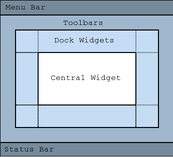
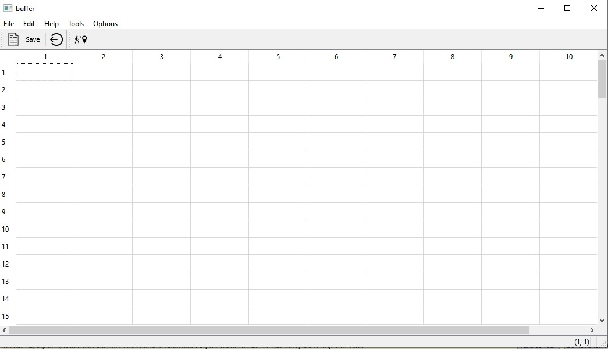
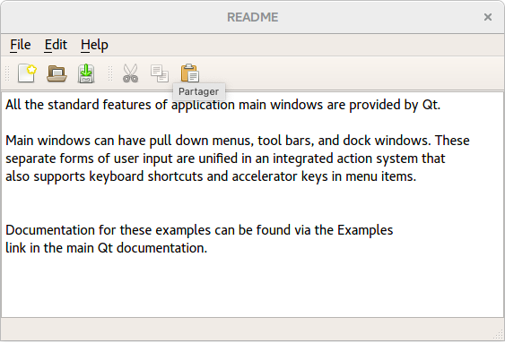
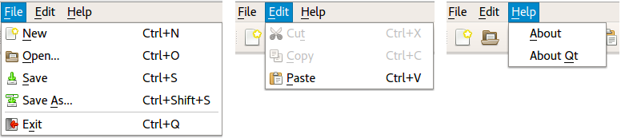

# Creating Main Windows
<br>

# Introduction :
<br>

For now, we've created some pretty basic windows inheriting from QWidget. This is indeed more than sufficient for small applications, but more tools are needed.

The <span style="color:red">QMainWindow  </span>  class has been specially designed to manage the main window of your application when it is complex. Among the features offered to us by the QMainWindow class, we find in particular the menus, the toolbar and the status bar.

The class QMainWindow inherits directly from QWidget. It is a widget that is generally used once per program and is only used to create the main window of the application.

A main window can be made up of all these elements:



* **Menu Bar**: This is where you will be able to create your File, Edit, View, Help, etc. menu.

* **Toolbars**: In a text editor, for example, we have icons to create a new file, to save, etc.

* **Dock Widgets**: more complex and more rarely used, these docks are containers that are placed around the main window. They can contain tools, for example the different types of brushes that one can use when making drawing software.

* **Central Widget**: this is the heart of the window, where there will be the actual content.

* **Status Bar**: It generally displays the status of the program ("Ready / Recording in progress", etc.).
<br>

In this practical course we will focus on writing a set of basic functionality .
Our first iteration of the spreadsheet is obtain an application with:
* Menu Bar
* Two tools bars
* Status bar to print the informations

<br>

> The header file (mySpreadSheet.h)

```java script
class mySpreadSheet : public QMainWindow
{
    Q_OBJECT

public:
    mySpreadSheet(QWidget *parent = nullptr);
    ~mySpreadSheet();

protected:
    void setupMainWidget();
    void createActions();
    void createMenus();
    void createToolBars();
    void makeConnexions();
    void saveContent(QString filename) const;
    void loadContent(QString filename) const;


private slots:
    void close();
    void updateStatusBar(int, int); //Respond for the call changed
    void goCellSlot();
    void findCell();
    void saveSlot(); 
    void saveAsSlot();
    void loadSlot();


 //Pointers
private:
    
    QTableWidget *spreadsheet;
    // actions
    QAction * newFile;
    QAction * open;
    QAction * save;
    QAction * saveAs;
    QAction * exit;
    QAction *cut;
    QAction *copy;
    QAction *paste;
    QAction *deleteAction;
    QAction *find;
    QAction *row;
    QAction *Column;
    QAction *all;
    QAction *goCell;
    QAction *recalculate;
    QAction *sort;
    QAction *showGrid;
    QAction *auto_recalculate;
    QAction *about;
    QAction *aboutQt;
    QAction *load;


    //menus
    QMenu *editMenu;
    QMenu *toolsMenu;
    QMenu *optionsMenu;
    QMenu *helpMenu;


    QLabel *cellLocation;  //position of the active cell
    QLabel *cellFormula;   //Active cell formula

    
    QString *currentFile;

};
```

>The imlementation file (mySpreadSheet.cpp)
```java script
mySpreadSheet::mySpreadSheet(QWidget *parent)
    : QMainWindow(parent)
{
    //Seting the spreadsheet

    setupMainWidget();

    // Creaeting Actions
    createActions();

    // Creating Menus
    createMenus();

    makeConnexions();

     //creating tool bar
    createToolBars();

    //Creating the labels for the status bar
    cellLocation = new QLabel("(1, 1)");
    cellFormula = new QLabel("");
    statusBar()->addPermanentWidget(cellLocation);
    statusBar()->addPermanentWidget(cellFormula);


    currentFile=nullptr;
    setWindowTitle("buffer");
}

mySpreadSheet::~mySpreadSheet()
{ delete spreadsheet;

    
    delete  newFile;
    delete  open;
    delete  save;
    delete  saveAs;
    delete  exit;
    delete cut;
    delete copy;
    delete paste;
    delete deleteAction;
    delete find;
    delete row;
    delete Column;
    delete all;
    delete goCell;
    delete recalculate;
    delete sort;
    delete showGrid;
    delete auto_recalculate;
    delete about;
    delete aboutQt;

    delete FileMenu;
    delete editMenu;
    delete toolsMenu;
    delete optionsMenu;
    delete helpMenu;

}
void mySpreadSheet::setupMainWidget()
{
    spreadsheet = new QTableWidget;
    spreadsheet->setRowCount(100);
    spreadsheet->setColumnCount(10);
    setCentralWidget(spreadsheet);

}
void mySpreadSheet::createActions()
{
    //New File
   QPixmap newIcon(":/new_file.png");
   newFile = new QAction(newIcon, "&New", this);
   newFile->setShortcut(tr("Ctrl+N"));


    // open file
   open = new QAction("&Open", this);
   open->setShortcut(tr("Ctrl+O"));


    //open file
   save = new QAction("&Save", this);
   save->setShortcut(tr("Ctrl+S"));

    // open file
   saveAs = new QAction("save &As", this);


    //open file
   QPixmap cutIcon(":/cut_icon.png");
   cut = new QAction(newIcon, "Cu&t", this);
   cut->setShortcut(tr("Ctrl+X"));

   // Cut menu
   copy = new QAction( "&Copy", this);
   copy->setShortcut(tr("Ctrl+C"));


   paste = new QAction( "&Paste", this);
   paste->setShortcut(tr("Ctrl+V"));


   deleteAction = new QAction( "&Delete", this);
   deleteAction->setShortcut(tr("Del"));


   row  = new QAction("&Row", this);
   Column = new QAction("&Column", this);
   all = new QAction("&All", this);
   all->setShortcut(tr("Ctrl+A"));


   QPixmap findIcon(":/search_icon.png");
   find= new QAction(newIcon, "&Find", this);
   find->setShortcut(tr("Ctrl+F"));

   QPixmap goCellIcon(":/go_to_icon.png");
   goCell = new QAction( goCellIcon, "&Go to Cell", this);
   deleteAction->setShortcut(tr("f5"));

   about =  new QAction("&About");
   aboutQt = new QAction("About &Qt");

   recalculate = new QAction("&Recalculate",this);
   recalculate->setShortcut(tr("F9"));


   sort = new QAction("&Sort");

   load =new QAction("&Load");


   showGrid = new QAction("&Show Grid");
   showGrid->setCheckable(true);
   showGrid->setChecked(spreadsheet->showGrid());

   auto_recalculate = new QAction("&Auto-recalculate");
   auto_recalculate->setCheckable(true);
   auto_recalculate->setChecked(true);

    // --------- exit -------------------
   QPixmap exitIcon(":/quit_icon.png");
   exit = new QAction(exitIcon,"E&xit", this);
   exit->setShortcut(tr("Ctrl+Q"));

}
void mySpreadSheet::createMenus(){
    //filemenu
    FileMenu = menuBar()->addMenu("&File");
    FileMenu->addAction(newFile);
    FileMenu->addAction(open);
    FileMenu->addAction(save);
    FileMenu->addAction(saveAs);
    FileMenu->addSeparator();
    FileMenu->addAction(exit);
    FileMenu->addAction(load);

    //edit menu
    editMenu = menuBar()->addMenu("&Edit");
    editMenu->addAction(cut);
    editMenu->addAction(copy);
    editMenu->addAction(paste);
    editMenu->addAction(deleteAction);
    editMenu->addSeparator();

    editMenu->addAction(find);
    editMenu->addAction(goCell);

    auto select = editMenu->addMenu("&Select");
    select->addAction(row);
    select->addAction(Column);
    select->addAction(all);


    //help menu
    helpMenu = menuBar()->addMenu("&Help");
    helpMenu->addAction(about);
    helpMenu->addAction(aboutQt);

    //Tools menu
    toolsMenu = menuBar()->addMenu("&Tools");
    toolsMenu->addAction(recalculate);
    toolsMenu->addAction(sort);


    //Optins menus
    optionsMenu = menuBar()->addMenu("&Options");
    optionsMenu->addAction(showGrid);
    optionsMenu->addAction(auto_recalculate);

}
void mySpreadSheet::createToolBars()
{

    //Create a toolbar
    auto toolbar1 = addToolBar("File");


    //Add actions to the bar
    toolbar1->addAction(newFile);
    toolbar1->addAction(save);
    toolbar1->addSeparator();
    toolbar1->addAction(exit);


    auto toolbar2  = addToolBar("ToolS");
    toolbar2->addAction(goCell);

}
void mySpreadSheet::updateStatusBar(int row, int col)
{
    QString cell{"(%0, %1)"};
   cellLocation->setText(cell.arg(row+1).arg(col+1));

}

void mySpreadSheet::close()
{

    auto reply = QMessageBox::question(this, "Exit","Do you really want to quit?");
    if(reply == QMessageBox::Yes)
        qApp->exit();
}

void mySpreadSheet::makeConnexions()
{

   //Connexion for the  select all action 
   connect(all, &QAction::triggered,
           spreadsheet, &QTableWidget::selectAll);

   // Connection for the  show grid
   connect(showGrid, &QAction::triggered,
           spreadsheet, &QTableWidget::setShowGrid);

   //Connection for the exit button
   connect(exit, &QAction::triggered, this, &mySpreadSheet::close);


   //connection of any element in the spreadsheet with the update status bar
   connect(spreadsheet, &QTableWidget::cellClicked, this,  &mySpreadSheet::updateStatusBar);

   //connection for goDiolog

    connect(goCell ,&QAction::triggered,this,&mySpreadSheet::goCellSlot);

    connect(find,&QAction::triggered,this,&mySpreadSheet::findCell);

    //connect the save action to saveslot
    connect(save,&QAction::triggered,this,&mySpreadSheet::saveSlot);


    //connect the saveas action
    connect(saveAs,&QAction::triggered,this,&mySpreadSheet::saveAsSlot);


}
void mySpreadSheet::goCellSlot(){
    //create the dialog
    GoDialog D;
    //execute the dialog
     auto reply =  D.exec();
    //verifier si le dialog a été accepté
     if(reply == GoDialog::Accepted)
        {
         //extract the text
         QString cell =D.getCell();

         //extract the ligne
         int row = cell[0].toLatin1() -'A';

         //extract the column
         cell =cell.remove(0,1);
         int col= cell.toInt()-1;

         //changer de cellule
         statusBar()->showMessage("changing the current cell",2000);
         spreadsheet->setCurrentCell(row,col);

     }
}
void mySpreadSheet::findCell(){

    findDialog f;

     auto reply =  f.exec();

     //extract the text
     QString cell =f.getCell();
     int rows = spreadsheet->rowCount();
     int cols = spreadsheet->columnCount();

     for (int i=0;i<rows ;i++){
        for (int j=0;j<cols ;j++){
           auto location = spreadsheet->item(i,j);
           if(location && location->text()==cell){
               spreadsheet->setCurrentCell(i, j);
               return;
        }
     }
   }
}

void mySpreadSheet::saveSlot(){
    if(!currentFile){
        //create  Factory design
        QFileDialog D;
        auto filename = D.getSaveFileName();
         currentFile = new QString(filename);
        setWindowTitle(*currentFile);
    }
    //save content
    saveContent(*currentFile);
}

void mySpreadSheet::saveAsSlot(){
    if(!currentFile){
        //create Factory design
        QFileDialog D; //factory
        auto filename = D.getSaveFileName();
         currentFile = new QString(filename);
        setWindowTitle(*currentFile);
    }
    //save content
    saveContent(*currentFile);
};

void mySpreadSheet::loadSlot(){

    QFileDialog D;
    auto filename = D.getOpenFileName();

    if (filename != ""){
       currentFile = new QString(filename);
       setWindowTitle(filename);
       loadContent(*currentFile);
    }

;


};


```

And here is the result of our first iteration:
<br>


<br>

## Go Dialog


>The header file (goDialog.h)
```java script
namespace Ui {
class GoDialog;
}

class GoDialog : public QDialog
{
    Q_OBJECT

public:
    explicit GoDialog(QWidget *parent = nullptr);
    ~GoDialog();
    QString getCell()const;//getter pour le text du lineEdit

private:
    Ui::GoDialog *ui;
};
```

>The implementation file (goDialog.cpp)
```java script
GoDialog::GoDialog(QWidget *parent) :
    QDialog(parent),
    ui(new Ui::GoDialog)
{
    ui->setupUi(this);

    //expression réguliere
    QRegExp exp {"[A-Z][1-9][0-9]{0,2}"};

    //valider l'expression
    ui->lineEdit->setValidator(new QRegExpValidator(exp));
}

GoDialog::~GoDialog()
{
    delete ui;
}
QString GoDialog::getCell()const
{
return ui->lineEdit->text();
}
```
<br>

## Find Dialog

 This dialog prompts the user for a input and seek a cell that contains the entered text.

 >The header file (findDialog.h)
 ```java script
namespace Ui {
class findDialog;
}

class findDialog : public QDialog
{
    Q_OBJECT

public:
    explicit findDialog(QWidget *parent = nullptr);
    ~findDialog();
    QString getCell()const;//getter pour le text du lineEdit


private:
    Ui::findDialog *ui;
};
 ```

 >The implementation file (findDilog.cpp)
 ```java script
findDialog::findDialog(QWidget *parent) :
    QDialog(parent),
    ui(new Ui::findDialog)
{
    ui->setupUi(this);
}

findDialog::~findDialog()
{
    delete ui;
}
QString findDialog::getCell()const
{
return ui->lineEdit->text();
}
 ```

 <br>

 ## Saving Files
 ```java script
void mySpreadSheet::saveContent(QString filename)const
{
    //pointer to a file
    QFile file(filename);

    //open file in write mode
    if(file.open(QIODevice::WriteOnly))
    {
        QTextStream out(&file);

        //Browse cells and save
        int rows = spreadsheet->rowCount();
        int cols = spreadsheet->columnCount();

        for (int i=0;i<rows ;i++){
           for (int j=0;j<cols ;j++){
                auto cell=spreadsheet->item(i,j);
                if(cell){
                    out<< i <<","<<j <<","<<cell->text() <<endl;
                }
           }
        }
    }
    file.close();
}

```


## Loading Files 

 ```java script
 void mySpreadSheet::loadContent(QString filename)const
 {
    QFile file(filename);
    if(file.open(QIODevice::ReadOnly)){
        //
        QTextStream in(&file);
        QString line;
        while(!in.atEnd()){
            line= in.readLine();
            auto tokens=line.split(QChar(','));
            auto row = tokens[0].toInt();
            auto col = tokens[0].toInt();
            spreadsheet->setItem(row,col,new QTableWidgetItem(tokens[2]));
        }
       }


 }
 ```
 <br>

 # Text Editor
The goa is to display the following form:

 

First, we will create project with  resources file (icons) and we will add the following menus:
<br>



>The header file (WordText.h)

```java script
class WordText : public QMainWindow
{
    Q_OBJECT

public:
    WordText();

    void loadFile(const QString &fileName);

protected:
    void closeEvent(QCloseEvent *event) override;

private slots:
    void newFile();
    void open();
    bool save();
    bool saveAs();
    void about();
   
private:
    
    QTableWidget *spreadsheet;
    // actions
    QAction * newFile;
    QAction * open;
    QAction * save;
    QAction * saveAs;
    QAction * exit;
    QAction *cut;
    QAction *copy;
    QAction *paste;
    QAction *about;
    QAction *aboutQt;

    //menus
    QMenu *editMenu;
    QMenu *FileMenu;
    QMenu *helpMenu;

private:
    void createActions();
    void createMenus();
    void makeConnexions();
    bool saveFile(const QString &fileName);
    void setCurrentFile(const QString &fileName);
   
    QPlainTextEdit *textEdit;
    QString currentFile;
};
```
>The implementation file (WordText.cpp)
```java script

WordText::WordText(QWidget *parent)
    : QMainWindow(parent)
{

   
    createActions();
    createMenus();
    makeConnexions();

     

    //Creating the labels for the status bar
    cellLocation = new QLabel("(1, 1)");
    cellFormula = new QLabel("");
    statusBar()->addPermanentWidget(cellLocation);
    statusBar()->addPermanentWidget(cellFormula);


    currentFile=nullptr;
    setWindowTitle("buffer");
}

WordText::~WordText()
{ 
    delete  newFile;
    delete  open;
    delete  save;
    delete  saveAs;
    delete  exit;
    delete cut;
    delete copy;
    delete paste;
    delete about;
    delete aboutQt;
    delete FileMenu;
    delete editMenu;
    delete helpMenu;
}

void WordText::createActions()
{
    //New File
   QPixmap newIcon(":/new_file.png");
   newFile = new QAction(newIcon, "&New", this);
   newFile->setShortcut(tr("Ctrl+N"));


    // open file
   open = new QAction("&Open", this);
   open->setShortcut(tr("Ctrl+O"));


   save = new QAction("&Save", this);
   save->setShortcut(tr("Ctrl+S"));

   saveAs = new QAction("save &As", this);

    
   QPixmap cutIcon(":/cut_icon.png");
   cut = new QAction(newIcon, "Cu&t", this);
   cut->setShortcut(tr("Ctrl+X"));

   // Cut 
   copy = new QAction( "&Copy", this);
   copy->setShortcut(tr("Ctrl+C"));

//paste
   paste = new QAction( "&Paste", this);
   paste->setShortcut(tr("Ctrl+V"));


   row  = new QAction("&Row", this);
   Column = new QAction("&Column", this);
   all = new QAction("&All", this);
   all->setShortcut(tr("Ctrl+A"));

   about =  new QAction("&About");
   aboutQt = new QAction("About &Qt");

   QPixmap exitIcon(":/quit_icon.png");
   exit = new QAction(exitIcon,"E&xit", this);
   exit->setShortcut(tr("Ctrl+Q"));

}
void WordText::createMenus(){
    //filemenu
    FileMenu = menuBar()->addMenu("&File");
    FileMenu->addAction(newFile);
    FileMenu->addAction(open);
    FileMenu->addAction(save);
    FileMenu->addAction(saveAs);
    FileMenu->addSeparator();
    FileMenu->addAction(exit);
    //edit menu
    editMenu = menuBar()->addMenu("&Edit");
    editMenu->addAction(cut);
    editMenu->addAction(copy);
    editMenu->addAction(paste);
    editMenu->addSeparator();
    //help menu
    helpMenu = menuBar()->addMenu("&Help");
    helpMenu->addAction(about);
    helpMenu->addAction(aboutQt);

}
void WordText::close()
{

    auto reply = QMessageBox::question(this, "Exit","Do you really want to quit?");
    if(reply == QMessageBox::Yes)
        qApp->exit();
}


 
```
<br>


 # In summary
<br>

* A QMainWindow is a main window. It can contain panes, menus, toolbar, status bar, etc.
* The toolbar can contain all types of widgets.
* Menus and toolbars share the same generic element: the QAction. The same QAction can be used both in the menu and in the toolbar.
<br>
   
    I hope that you enjoyed this practical course ,See you in the next one course with new things 😄 